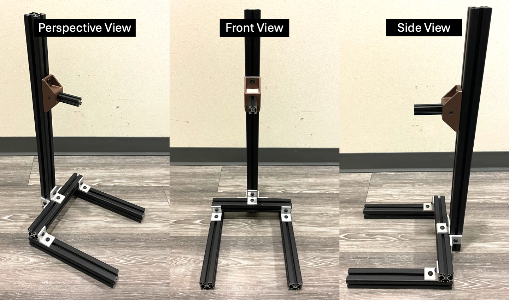

.. _safety_stand:

Safety Stand
=============

If you don't have aluminum extrusions by hand, you can purchase the safety stand section as listed in the :ref:`bill_of_materials`.

We present one solution as shown in the image below. We use 300mm 4040 aluminum extrusions (\*3), 
700mm 4040 aluminum extrusion (\*1), and 100mm 2020 aluminum extrusion (\*1). For the 4040s, 7ou can use 
500mm 4040 aluminum extrusions (\*4) as in the bill of materials without any problem.

Pay attention to how we arrange the extrusions and place the connectors to maximize the stability of the stand.
We use 5 sets of 4040 corner connectors in total. For the 3D-printed connector between 2020 and 4040, you can find the 
sliced plate in the `MakerWorld <https://makerworld.com/en/models/1068768>`_ and the CAD file in the `Onshape document <https://cad.onshape.com/documents/caabd85045529e21c4b05cfa>`_. 
We also put optional 3D-printed feet in the same document in case you want to avoid scratching the floor or the table.

.. note::

   This is not the only possible solution, but it is essential to ensure strong support along the axis where a 
   significant torque will be applied when mounting the robot onto the stand.

