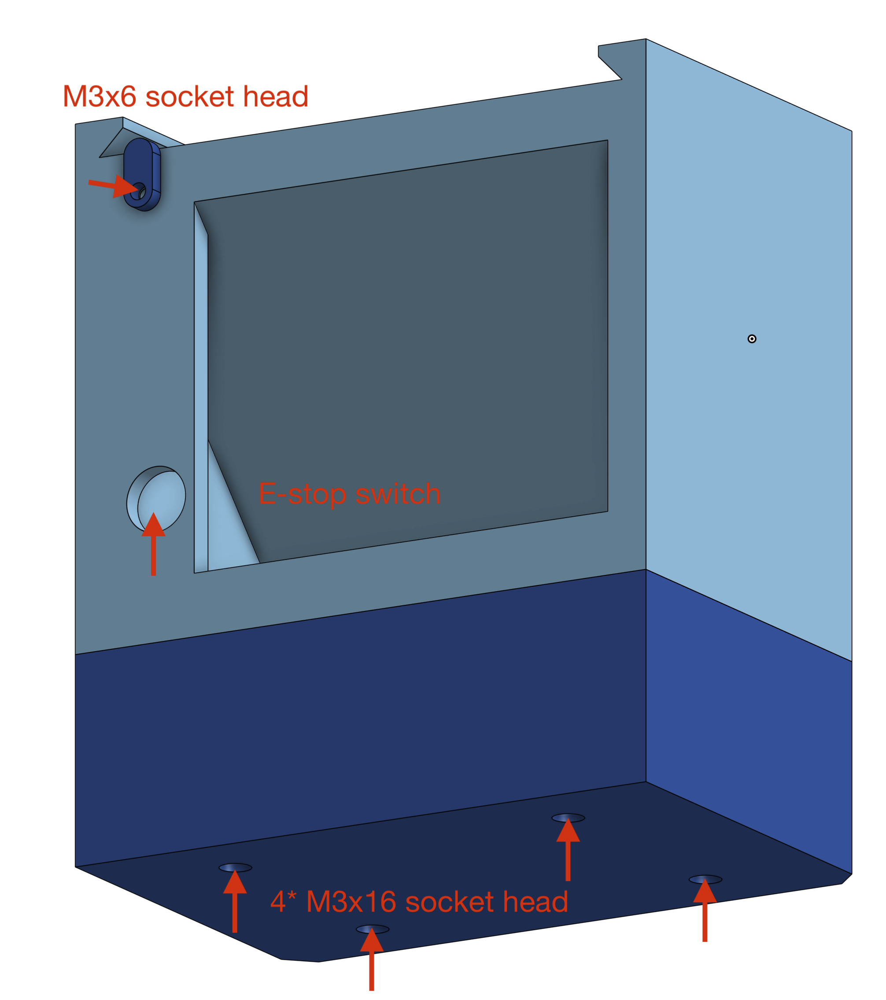
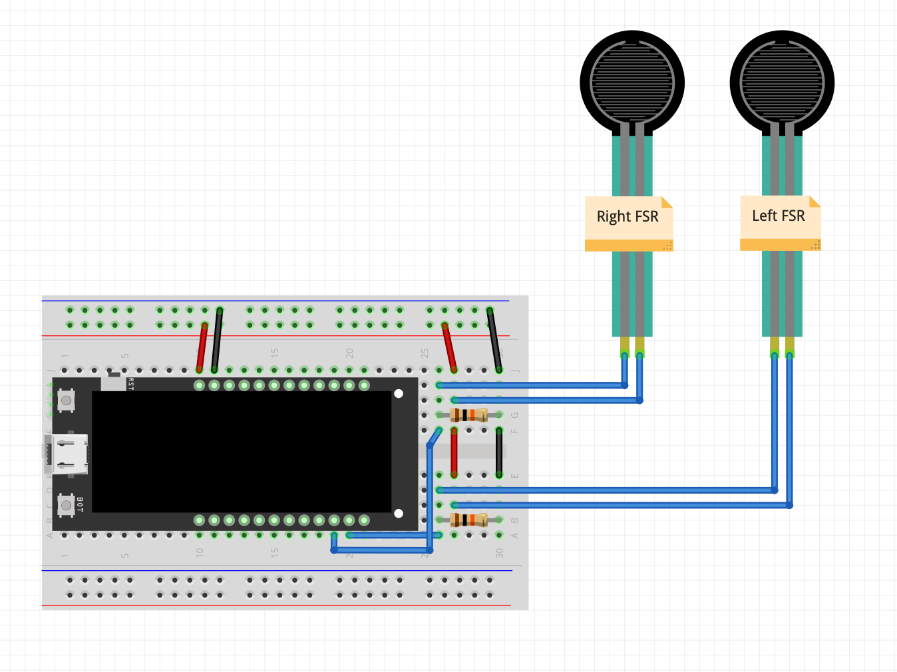

.. _teleoperation_arms:

Teleoperation Arms (WIP)
=========================

Build the Arms and Prepare the Parts
------------------------------------------
To build a teleoperation leader, follow the same steps used for assembling the two arms.
Additionally, print an extra torso along with the teleoperation-specific components
as shown in the `MakerWorld <TODO>`_.

Assemble the Torso
----------------------------
When assembling the torso, install the teleop connector as shown in the image below. 
Use two M3x16 flat head screws to secure the connector, aligning it with the holes for the bevel gear.

.. image:: ../_static/teleop_connector.png
   :alt: Teleop connector
   :align: center
   :width: 100%

Assemble the Base
----------------------------
To clear the arms from the desk surface, we add a base with optional stack that can further raise the height, highly recommended! 
It should be pretty straight forward to assemble. Make sure you connect the wires to estop before you install it to the base.

Install the Teleop Grip, FSR & Circuits to Read FSR
------------------------------------------------------------
In the teleoperation plate you printed, there should be two hand grips, install them to the arm like shown in the image below (TODO).
Pay attention to the orientation of the left and right grips.

.. .. image:: ../_static/teleop_grip.png
..    :alt: Teleop grip
..    :align: center
..    :width: 100%

You will need a Lilygo T-Display S3 to read the FSR and display it to the screen, paired with a simple voltage divider circuit on breadboard. 
The resistors are both 10k. Use arduino IDE to upload :download:`this code <../_static/GFX_display_FSR.zip>`. 
Once you flash it, you should be able to see the two circles on the screen changing size when you press the grip.

Now attach the FSR to the slot in the grip with double-sided tapes, again, note the left and right orders! 

.. note::
   2XL430 motors have high static friction. During teleoperation, there's no need to worry about damaging them—apply more force if a joint is stuck; the motor can handle it.

Teleoperation Scripts
---------------------
TODO
