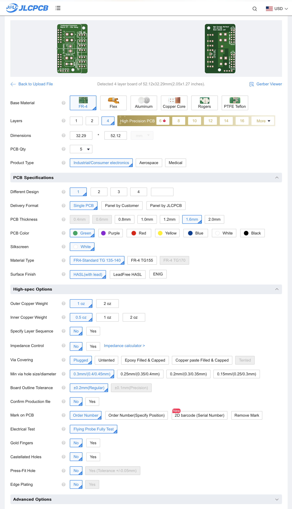
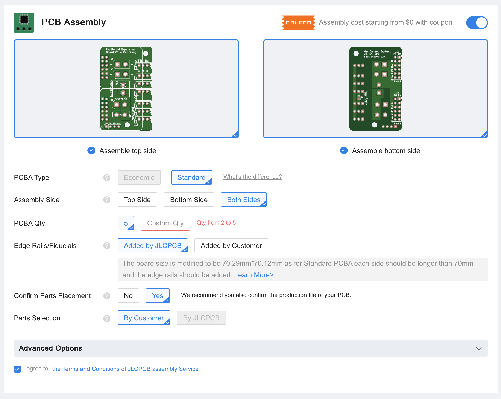
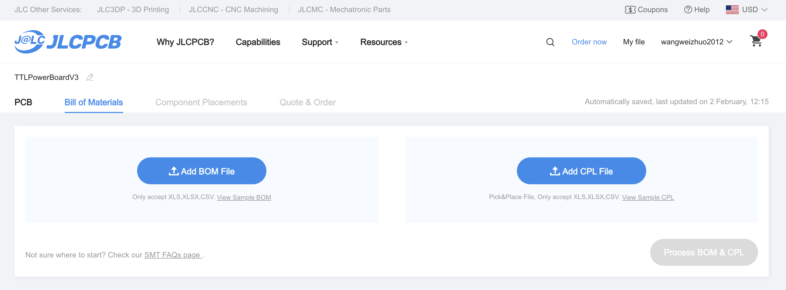
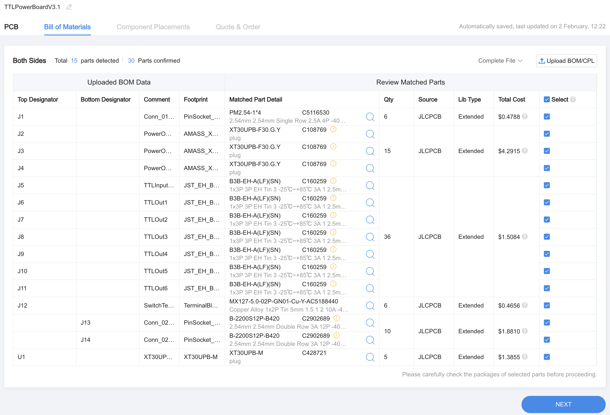
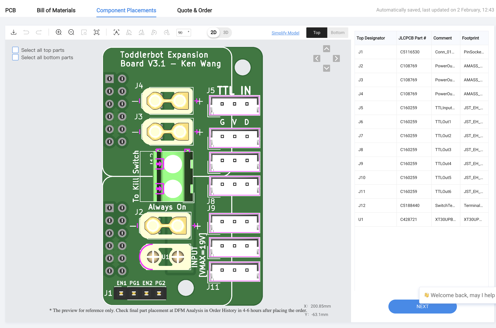
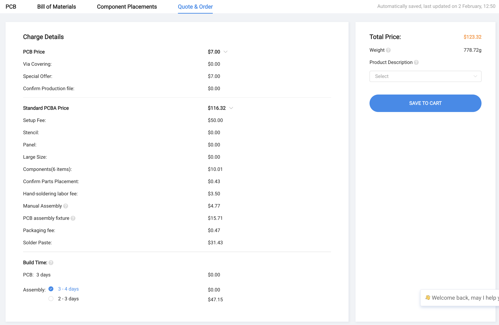

.. _pcb:

PCB Sourcing
=================

We have organized the PCB files in a way that you can just throw into `JLC PCB <https://jlcpcb.com/>`_ and order them.

PCB Order Options
--------------------------

When you log into JLC PCB, you will see the option to upload the files, drop in the :download:`PCB ZIP files <../_static/TTLPowerBoardV3.1.zip>`. 

There is no need to change anything in the PCB order options. You can double check the options as shown in the image below. 

.. note::
   You can remove mark if you don't want order number printed on the PCB.

.. note::
   We do need to change the assembly options. It's recommended to assembly both sides for your convenience, and order 5 pcs so that you have some extra lying around. 
   You can certainly order 2 pcs if budget is tight, but keep in mind that the final price doesn't differ much since it's mostly setup fees. Select the ``Confirm Parts Placement`` option.

PCB Assembly
----------------------------

When you click next, you will be prompted to upload your BOM and CPL file. Use these, drop them in the upload section:

- :download:`BOM - bom.csv <../_static/bom.csv>`
- :download:`CPL - positions.csv <../_static/positions.csv>`

.. note::
   When you hit next, it will prompt that there are some parts missing. It is fine, that's the mounting holes and jumper pads. 
   You can ignore this and **click continue**.

   .. image:: ../_static/jlc_error.png
      :alt: Ignore the error
      :align: center
      :width: 100%

Parts Confirmation
----------------------------

You will probably see the parts confirmed automatically. Likely evereything is in stock. If not, try to replace them with the similar parts.

You should see the parts nicely placed on the PCB, if not, correct them as shown in the image below, make sure all the parts are placed correctly.

Finalize the Order
----------------------------

You can now finalize the order. You will see the final price, and you can proceed to pay.

.. .. note::
..     Finally, if you would like to tinker with the PCB, here is the kicad file:
..     :download:`TTLPowerBoardV3.1.kicad_pcb <../_static/TTLPowerBoardV3.1.kicad_pcb>`