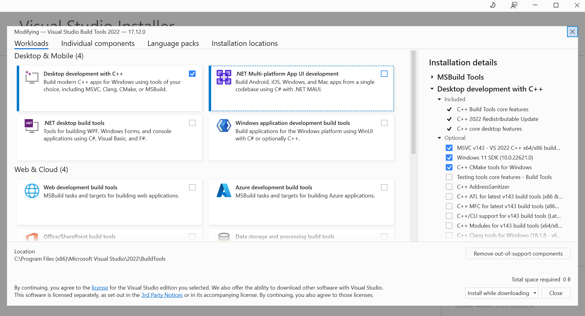

.. _rog_ally_x:

ROG Ally X
===================

The ROG Ally X is a powerful handheld Windows PC that can be used to control ToddlerBot remotely.
We recommend this over Steam Deck because it is easier to set up and has better performance.

Visual Studio Compiler
-----------------------------

You need to download and install C++ Build Tools from `this website <https://visualstudio.microsoft.com/visual-cpp-build-tools/>`_.
Run the ``.exe`` file and select the following options:

Access to the Joystick
----------------------

Modify the control mode of the joystick to "Gamepad" in the ROG Armoury Crate software.

Addtional Packages
----------------------

Run the following command in the Windows Powershell to bypass the execution policy:

.. code::

   Set-ExecutionPolicy RemoteSigned -Scope CurrentUser

Install ``choco``, ``git``, and ``ffmpeg``:

.. code::

   Set-ExecutionPolicy Bypass -Scope Process -Force; [System.Net.ServicePointManager]::SecurityProtocol = [System.Net.ServicePointManager]::SecurityProtocol -bor 3072; iex ((New-Object System.Net.WebClient).DownloadString('https://chocolatey.org/install.ps1'))

   choco install git ffmpeg

Dynamixel Latency Timer
-----------------------------
When connecting the remote controller to the leader arms, 
you need to set the latency timer to 1 to increase comminucation speed with the Dynamixel motors, 
This was done through command line on Linux systems, but on Windows, you need to do it manually.
In the device manager, find the COM port which dynamixel motors are connected to, go to properties, advanced, 
and change the latency timer value.

NTP Server
-----------------------------
For the accuracy of teleoperation and logging over network, we need to
install NTP to sync time of Jetson to ROG Ally X.

#. Go the device manager, find the COM port, go to properties, advanced, and change the latency timer value.

#. Enable Windows NTP Server in the Registry:

      Open Registry Editor.

      Press :kbd:`Win` + :kbd:`R`, type regedit, and hit Enter.
      Navigate to:

      HKEY_LOCAL_MACHINE\SYSTEM\CurrentControlSet\Services\W32Time\Config
      Modify AnnounceFlags:

      Double-click AnnounceFlags.
      Change the value to 5 (to enable NTP server mode).
      Click OK.

#. Enable NTP Server: Navigate to:

      HKEY_LOCAL_MACHINE\SYSTEM\CurrentControlSet\Services\W32Time\TimeProviders\NtpServer
      Double-click Enabled.
      Set its value to 1.
      Click OK.

#. Configure Windows Time Service:

      Open Command Prompt as Administrator.

      Enable Windows Time Service:

      .. code::

         sc config w32time start=auto
         net start w32time

#. Force Windows to Act as an NTP Server:

   .. code::

      w32tm /config /manualpeerlist:"time.windows.com" /syncfromflags:manual /update
      w32tm /config /reliable:YES
      w32tm /resync

#. Check NTP Server Status:

   .. code::

      net start w32time   
      w32tm /query /status
      w32tm /query /configuration

#. Test NTP Server from Jetson:

   .. code:: bash

      sudo ntpdate <windows_ip_address>
