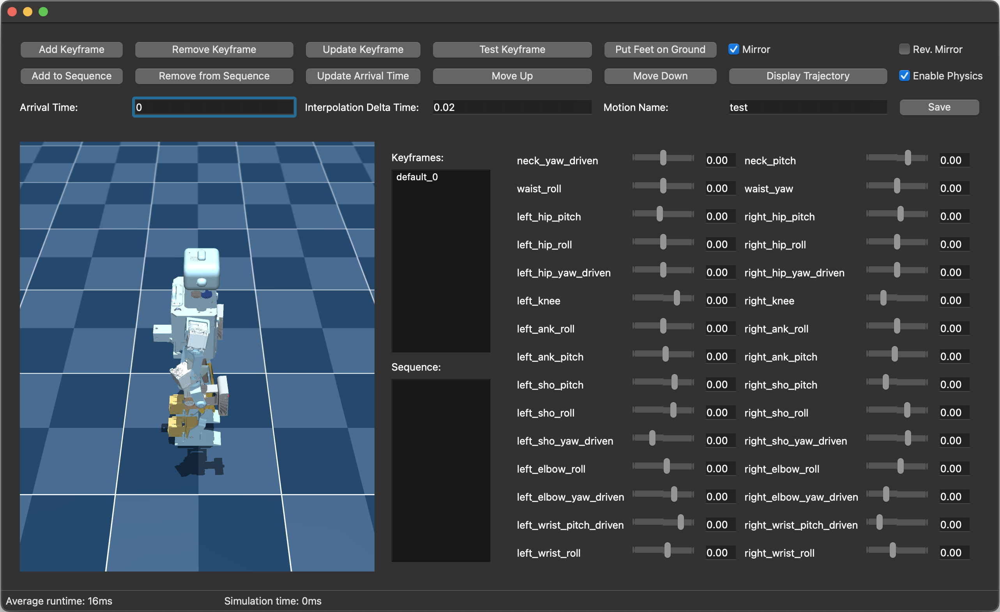

.. _keyframe_animation:

Keyframe Animation
=========================

The keyframe animation tool is a GUI-based tool that allows you to create keyframe animations for ToddlerBot.
With our digital twin, we can create keyframe animations and test them in MuJoCo before deploying them to the real robot.
Empirically, we found that most keyframe animations verified in MuJoCo can be deployed directly to the real robot with minimal tuning.

Run the following command to start the keyframe animation tool:

.. code::

   toddlerbot/tools/edit_keyframe.py --task <task_name>

You should see the following GUI:

Read the comments in the script for detailed information.

You're more than welcome to contribute your keyframe animation output from this tool to our repository by submitting a pull request!